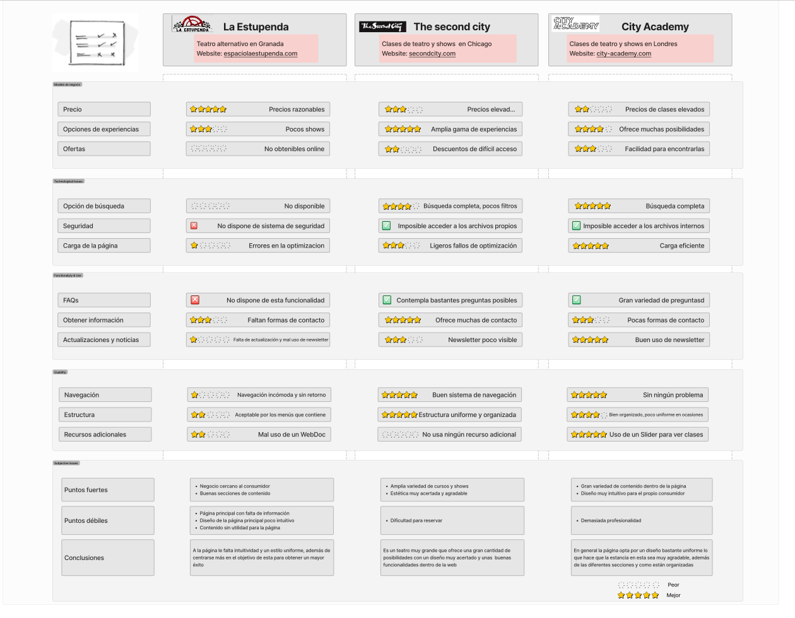
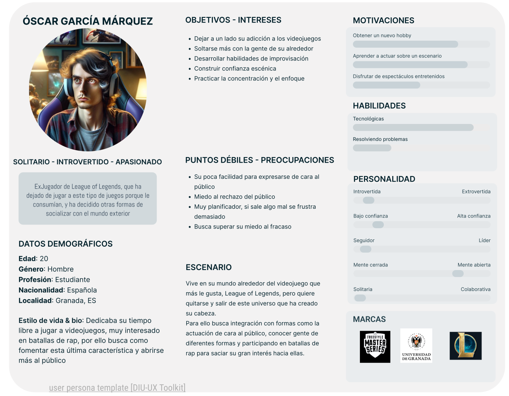
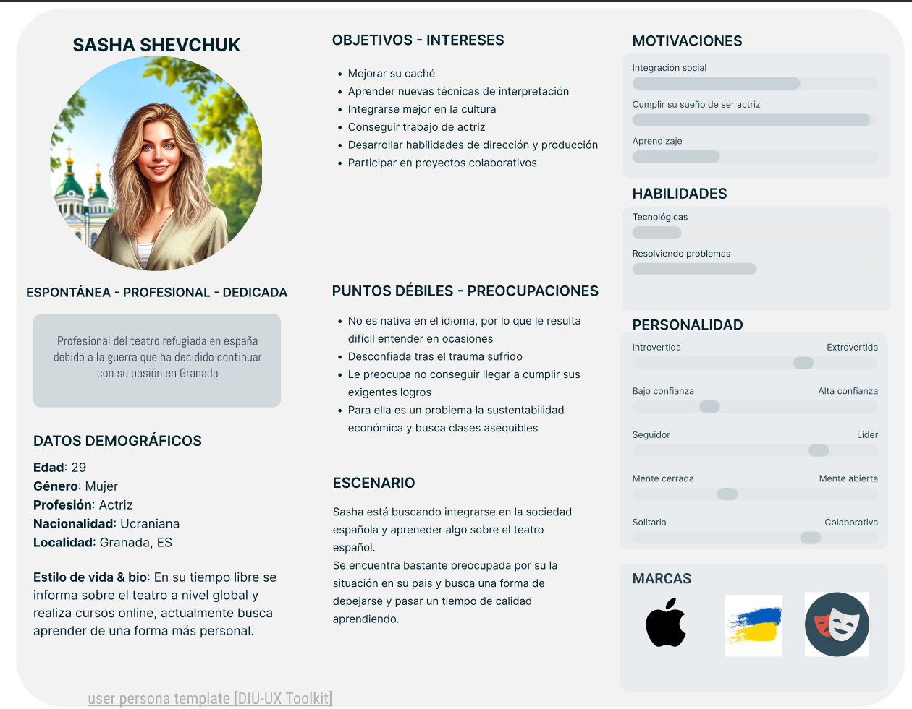
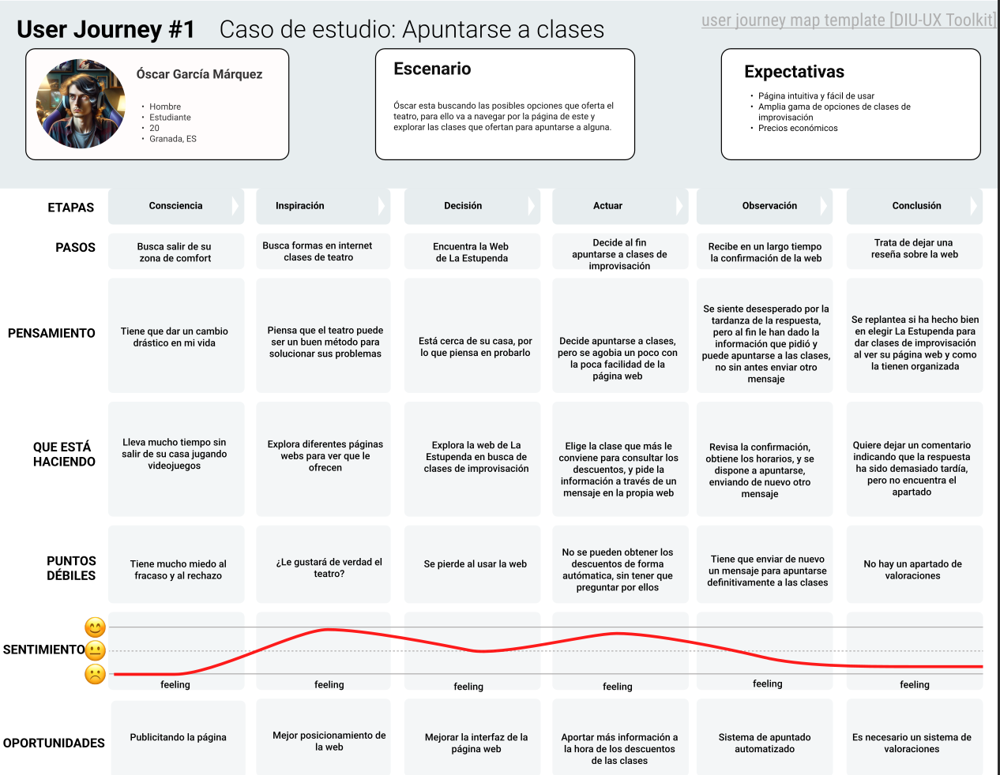
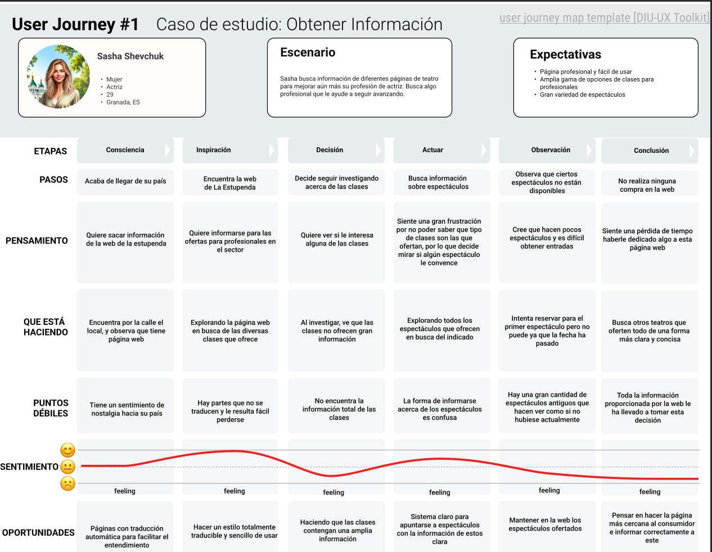

## DIU - Practica1, entregables

La Estupenda

- [x] User Research
- [x] Desk research: Análisis Competencia 
- [x] Creación de dos personas 
- [x] User Journey Map
- [x] Revisión de Usabilidad 

## Competitor Analyisis:

## Personas:

## Journey maps:

## Usability review:
[Usability Review](UsabilityReview.pdf)
### Puntuación: 42
### Briefing:
Nuestra mejora de la página la centramos en realizar una reestructuración de la página principal, añadiendo contenido que le puede resultar útil al consumidor, como por ejemplo enlaces para las diferentes secciones que sean más claros y que ocupen un primer lugar, un sistema de búsqueda personalizado y multiparamétrico, un sistema de reserva de clases automatizado y que aporte una mayor cantidad de información acerca de estas clases
Además proponemos un sistema para acceder con tu correo electrónico y contraseña, para que tengas guardados las diferentes clases que estas inscrito y espectáculos a los que has comprado una entrada, y para además poder dejar valoraciones de las diferentes clases y espectáculos. 
