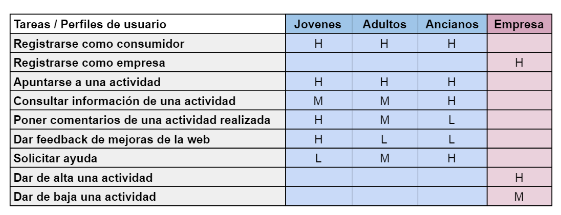
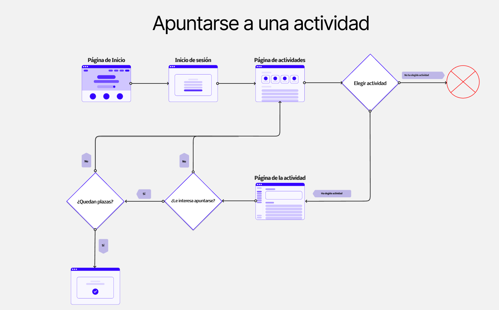
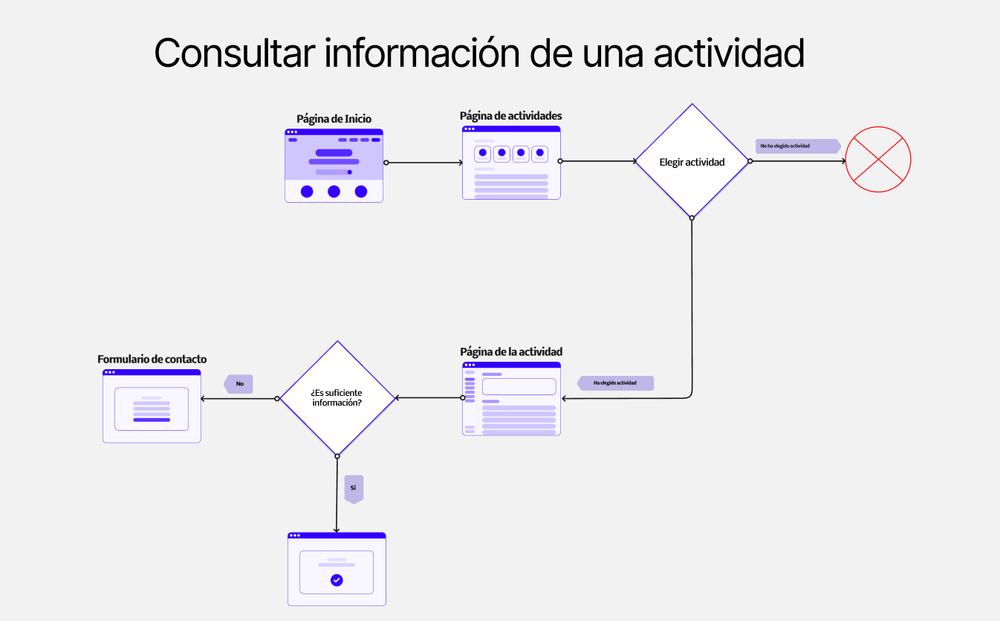
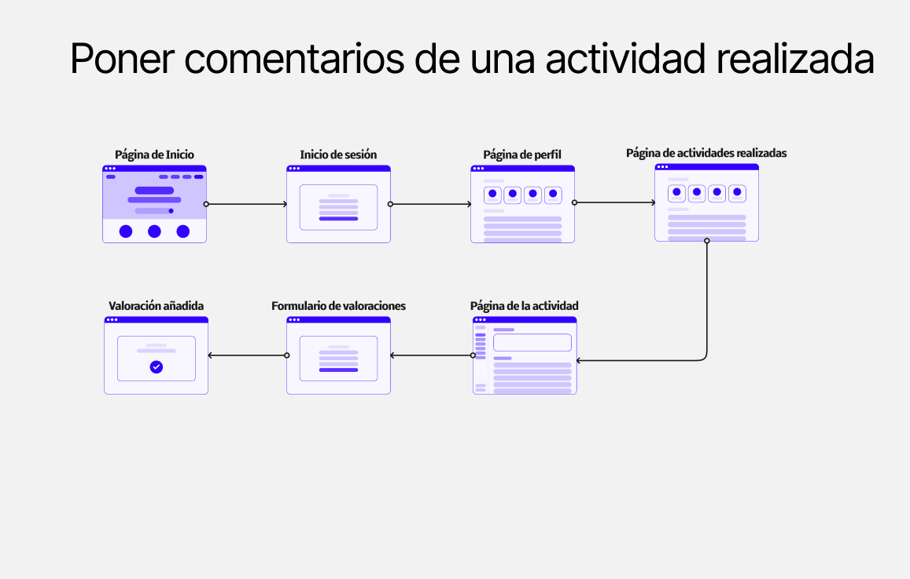
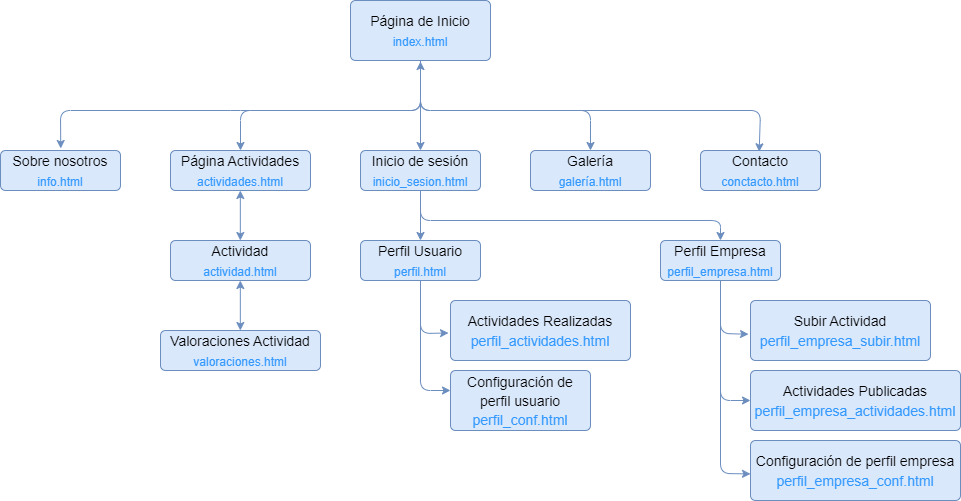
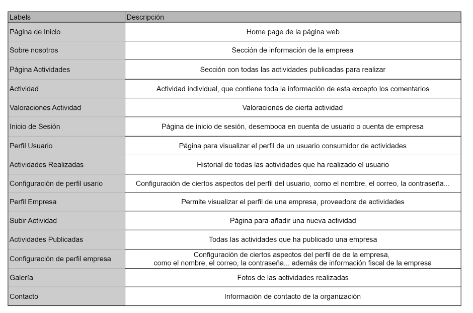
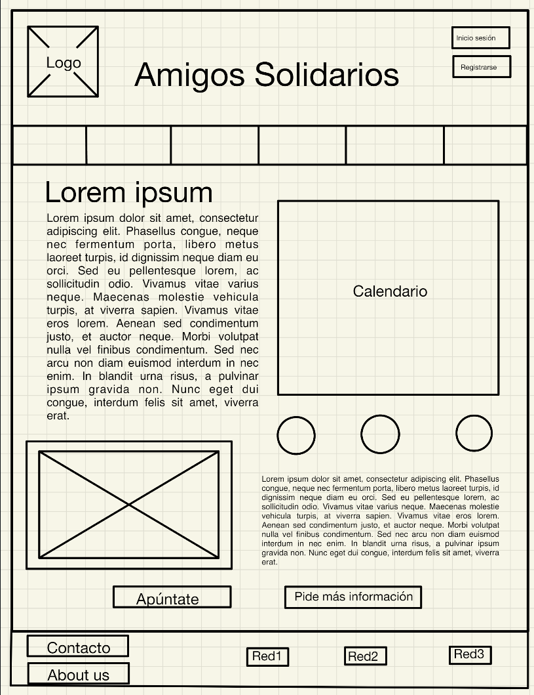
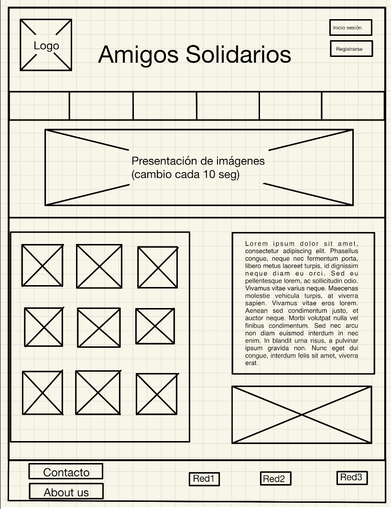

## DIU - Practica2, entregables

- [x] Reframing - Malla receptora de información
- [x] Propuesta de valor - Scope Canvas
- [x] Task Analysis - Tabla de anlásis de tareas
- [x] Task Analysis - User flow
- [x] Arquitectura de información - Sitemap
- [x] Arquitectura de información - Labelling
- [x] Prototipo - Esbozo a papel
- [x] Prototipo - Wireframe
- [x] Prototipo - Gridlayout

### Malla receptora de información

### Propuesta de valor

### TASK ANALYSIS

* Task Analysis Table
  
  

* User/Task flow
  
  
  

### ARQUITECTURA DE INFORMACIÓN

* Sitemap
  
* Labelling 
  

### Prototipo Lo-FI Wireframe 
* Boceto a papel
   
   

### Conclusiones  
(incluye valoración de esta etapa)
