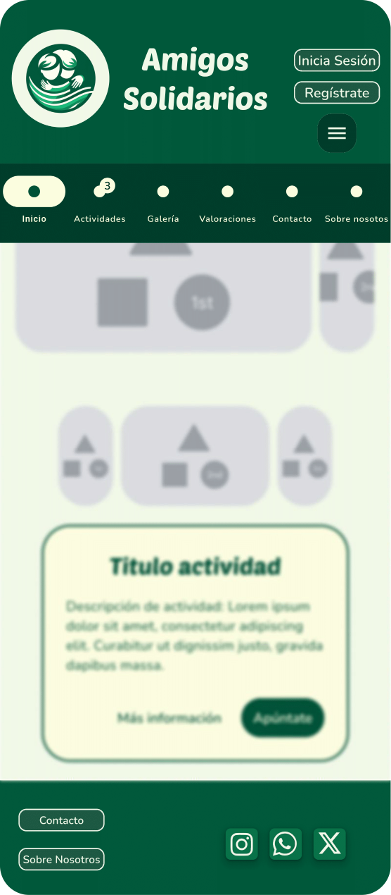

# DIU - Practica 3, entregables

## Moodboard (diseño visual + logotipo)   

## Landing Page

## Mockup: LAYOUT HI-FI
### Página de inicio

### Página inicio + menú

### Página inicio + formulario apúntate

### Página inicio + formulario apúntate + selección de fecha

### Página actividad

### Página activididad + menu

### Página actividad + formulario apúntate

### Página actividad + formulario apúntate + selección de fecha

### Calendario actividad

El fichero figma se encuentra en [este archivo](./LayoutHi-Fi.fig)

## Documentación: Publicación del Case Study
Para la realización de esta práctica nos hemos encontrado con problemas para desarrolar 
el layout Hi-Fi de una manera correcta, para conseguirlo hemos aprendido de los repositorios en case of study para conseguir realizar nuestro layout

Creemos que nuestro prototipo refleja de una manera correcta los conocimientos aprendidos en teoría, además pensamos que el moodboard y la landing page reflejan correctamente el objetivo de nuestro prototipo

 [Este vídeo contiene una demostración del funcionamiento del layout](https://drive.google.com/file/d/1uJa4eQMQVB4dG2UW1rfyJoETPq1K5wpG/view?usp=sharing)
