#### Evaluación de usabilidad del proyecto 

### Amigos Solidarios y Oasis

### 3/06/2024

[Enlace a GITHUB del proyecto]

### Realizado por:

Informe realizado por Equipo Yak-Madrugador. Tenemos experiencia en diseño de interfaces de usuario y pruebas de usabilidad, habiendo trabajado en múltiples proyectos enfocados en mejorar la experiencia del usuario en plataformas web.

## 1 DESCRIPCIÓN DEL WEBSITE

El propósito de las aplicaciones web evaluadas ("Amigos Solidarios" y "Oasis") es ofrecer una plataforma donde los usuarios puedan encontrar y participar en actividades y eventos organizados por la entidad, ya sea para familias o amigos. 

## 2 RESUMEN EJECUTIVO

Este documento contiene un análisis detallado de la usabilidad de las aplicaciones web "Amigos Solidarios" y "Oasis". Se realizaron pruebas de usabilidad con cuatro usuarios para identificar problemas y áreas de mejora. Los principales problemas detectados incluyen inconsistencias en la navegación y la integración de funciones en el sitio web "Oasis".

## 3 METODOLOGIA 

#### Metodología de usabilidad

Se utilizó la escala de usabilidad del sistema (SUS) para cuantificar la experiencia de usuario. Las sesiones incluyeron tareas específicas que los usuarios debían completar mientras se registraban sus respuestas y comportamientos.

#### Test de usuarios: Participantes

| Usuario | Sexo/Edad | Ocupación | Experiencia Internet | Plataforma | Perfil cubierto | Test | SUS Score |
|---------|-----------|-----------|----------------------|------------|-----------------|------|-----------|
| 1       | Hombre / 52 | Militar | Avanzado             | Phone      | Padre de una familia que busca actividades para toda la familia         | A    | 87.5      |
| 2       | Mujer / 16  | Estudiante | Intermedio          | Phone      | Estudiante busca informarse de todo lo ofertado por la web          | A    | 92.5      |
| 3       | Hombre / 25 | Profesor  | Intermedio          | Phone      | Profesor recién salido del grado de educación infantil         | B    | 67.5      |
| 4       | Mujer / 20  | Estudiante | Bajo                | Phone      | Estudiante del grado de comunicación audiovisual          | B    | 87.5      |

#### Resultados obtenidos

**Resultado de SUS:**

- **Amigos Solidarios (Test A):**
  - Usuario 1: 87.5
  - Usuario 2: 92.5

- **Oasis (Test B):**
  - Usuario 3: 67.5
  - Usuario 4: 87.5

- **Resultados A/B Testing**
    - La página de Amigos Solidarios es más consistente y fácil de comprender.
    - La navegabilidad de Oasis no es totalmente correcta y puede resultar confusa.
    - La página de Amigos Solidarios es más simple y consigue transmitir el mensaje de una manera más afectiva.
  
**Resultado de eyetracking:**

### Caso A:

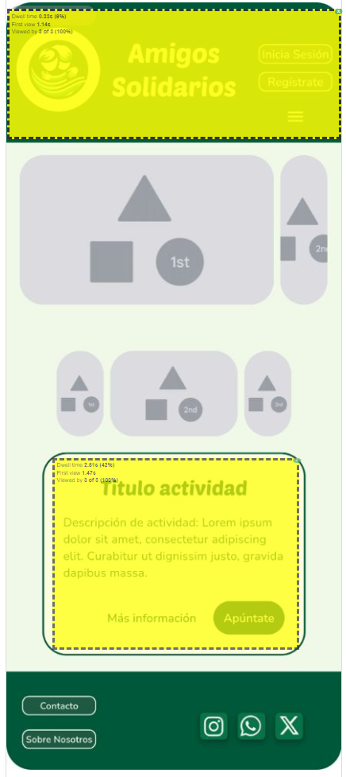

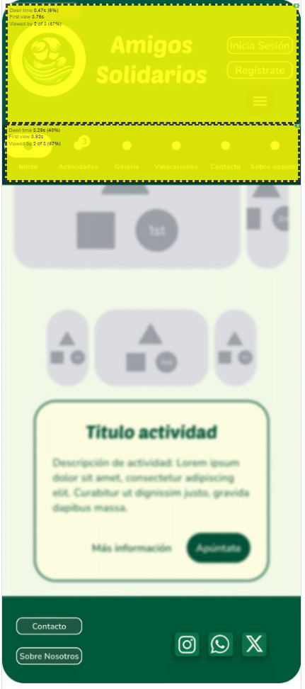

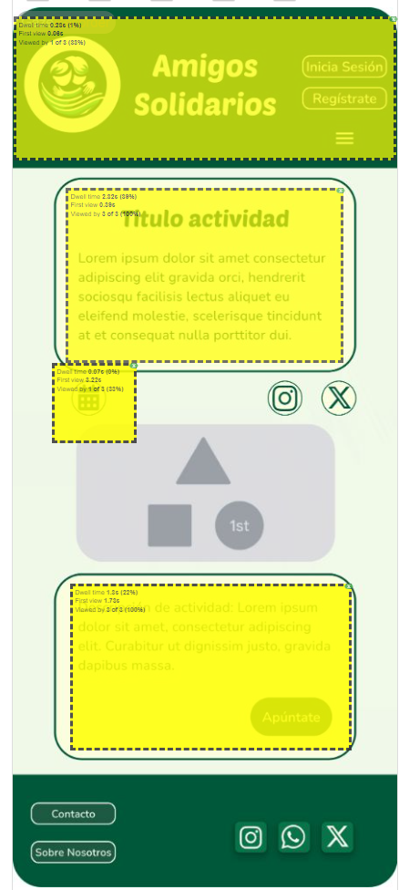

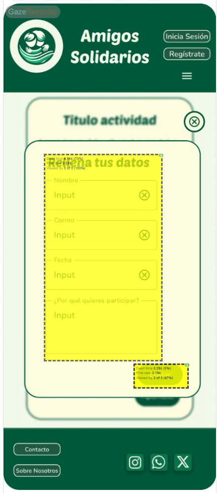

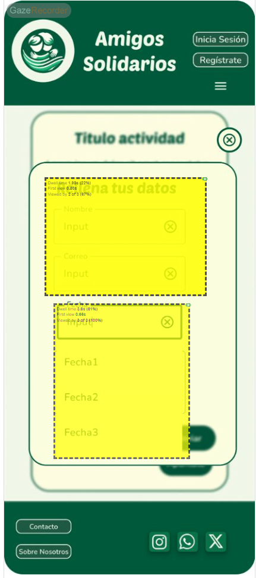

----
### Caso B:

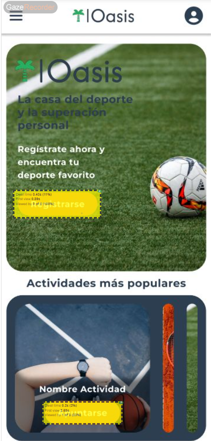

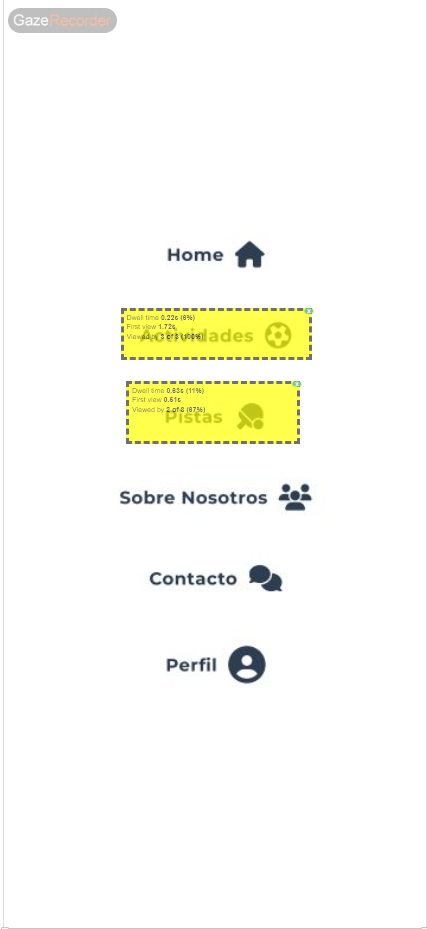

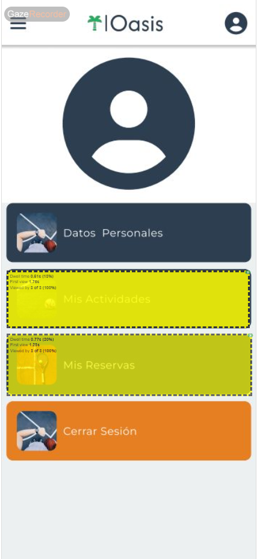

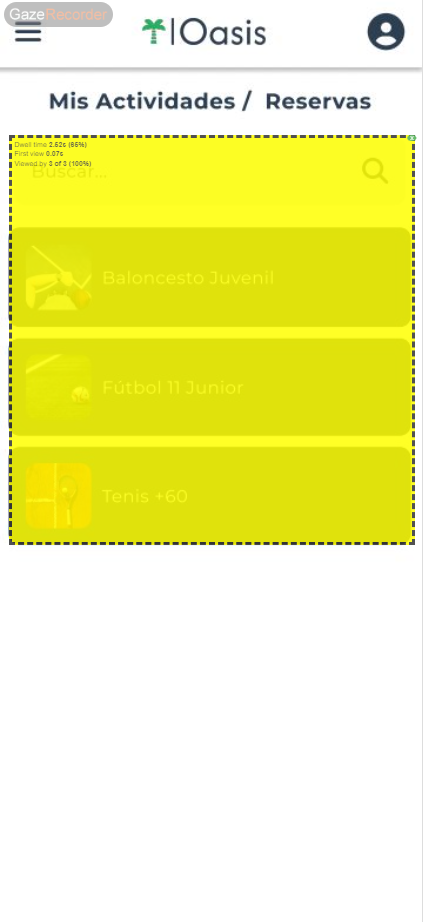

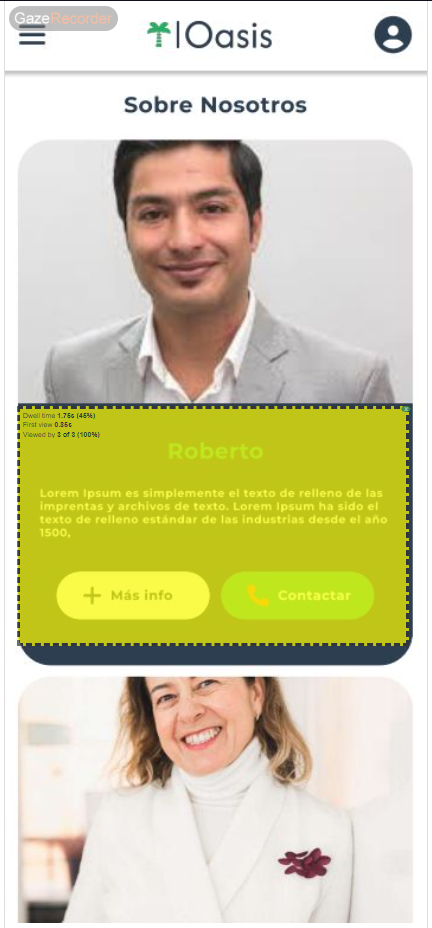

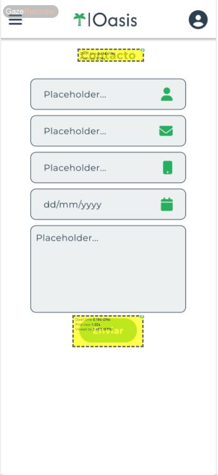

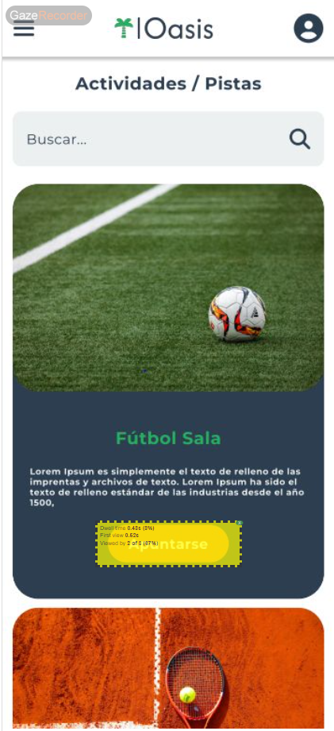

Además, incluimos los vídeos en el siguiente [enlace](https://drive.google.com/drive/folders/1U4BWmyqUrBIbJwl570SO4GQdlt9CDpRz?usp=sharing).

## 4 CONCLUSIONES 

Las pruebas de usabilidad revelan que "Amigos Solidarios" ofrece una mejor experiencia de usuario en comparación con "Oasis". La simplicidad y la buena integración de funciones fueron destacadas positivamente en "Amigos Solidarios", mientras que "Oasis" necesita mejorar la consistencia y la integración de sus funciones.

#### Incidencias

* No se presentaron incidencias mayores durante las pruebas. Todas las tareas fueron completadas exitosamente por los usuarios.

#### Valoración 

* **Puntos Positivos a destacar:**
  - "Amigos Solidarios" obtuvo altas puntuaciones en usabilidad.
  - Los usuarios encontraron el sitio fácil de navegar y confiable.

#### Recomendaciones y propuesta de mejoras: 

* **Puntos de mejora:**
  - Mejorar la consistencia y la integración de funciones en el sitio "Oasis".
  - Simplificar la navegación en ambos sitios para asegurar que sigue siendo intuitiva para todos los usuarios.

#### Valoración de la prueba de usabilidad (self-assessment)

Las técnicas de prueba de usabilidad utilizadas fueron efectivas para detectar errores y problemas de usabilidad ocultos. La utilización de cuestionarios SUS permitió obtener una evaluación cuantitativa clara de la experiencia del usuario, destacando áreas clave para la mejora continua. 

