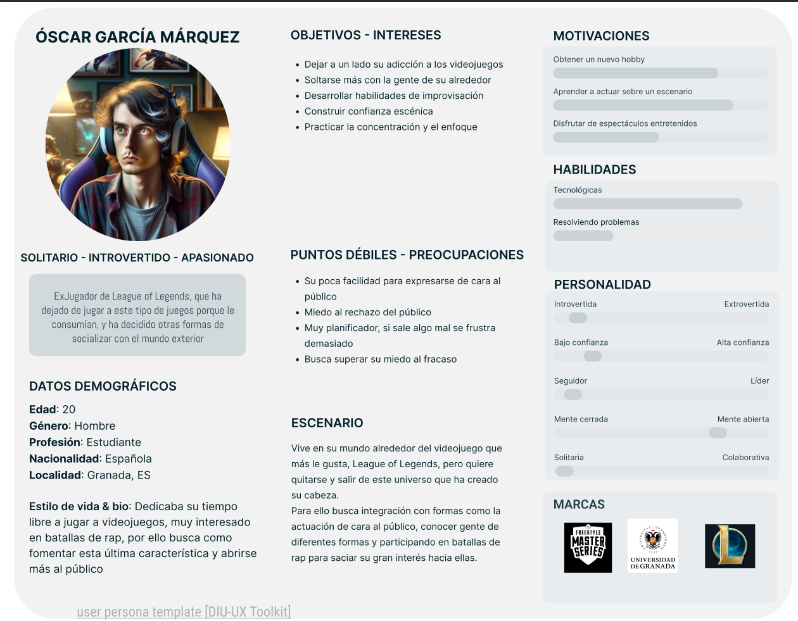
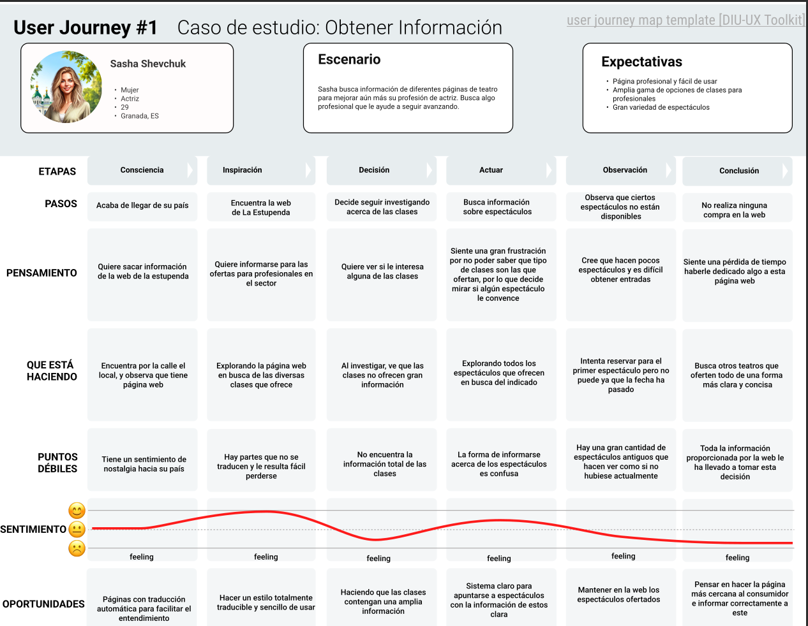
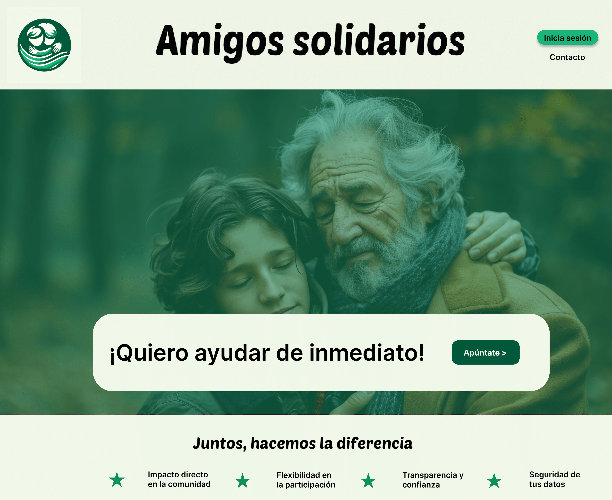

# DIU24
Prácticas Diseño Interfaces de Usuario 2023-24 (Tema: .... ) 

Grupo: DIU1_01AABB.  Curso: 2023/24 
Updated: 11/2/2024

Proyecto: 
>>> Amigos Solidarios

Descripción: 

>>> Nuestra idea consiste en la realización de una página web perteneciente a una organización sin ánimo de lucro que busca la realización de actividades sociales de todo tipo y en todos los niveles de la sociedad, para ello pretendemos crear un sistema con un amplio catálogo de actividades y un sistema de búsqueda eficaz para permitir al usuario realizar un uso fácil de la página y motivar al usuario para que participe en las actividades propuestas, además de incluir una manera de contactar e informar de nuevas actividades que podrían realizarse.

Logotipo: 

>>> 

Miembros
 * :bust_in_silhouette:   Pablo Blanco López    :imp:    
 * :bust_in_silhouette:   Jorge Sánchez Rodríguez    :innocent:

----- 

# Proceso de Diseño 

## Paso 1. UX User & Desk Research & Analisis 

 **1.a User Reseach Plan**
-----

>>> Ofrecemos soluciones específicas en torno a la experiencia del usuario para arreglar los problemas de la página web La Estupenda, y así benefeciar al negocio.
>>> [User Research](P1/UserResearchLaEstupenda.pdf)

 1.b Competitive Analysis
-----

>>> Describe brevemente características de las aplicaciones que tienes asignadas, y por qué has elegido una de ellas
>>> Hemos elegido dos aplicaciones, una de Chicago, The Second City, y otra de Londres, City Academy.
>>> Nos han interesado de ambas la navegación, la forma de obtener la información, siendo esta clara y concisa, y sobre todo la forma con la que actualizan todo lo que tiene que ver en la página. Con esto nos referimos a que por ejemplo para subscribirse al newsletter, en La Estupenda te sale un pop up para que puedas hacerlo, en cambio en las otras dos páginas, sale en una sección sin necesidad de estar preguntando todo el rato si queremos suscribirnos al newsletter.
>>> 

 1.c Persona
-----

>>> Nos ha parecido interesante hacer dos perfiles de personas que sean completamente contrarios, pero al final se puede observar que ninguno de ellos, aunque sean complementarios, se quedan satisfechos con la página.
>>> 
>>> 

 1.d User Journey Map
----
>>> La hemos elegido debido a que son acciones que tiende a realizarse muy amenudo ene este estilo de páginas y creemos que encajan de una manera basstante correcta con nuestras personas.
>>> 
>>> 

 1.e Usability Review
----
>>> - Enlace al documento:  [Usability Review](P1/UsabilityReview.pdf)
>>> - Valoración final: 44
>>> - Comentario sobre la valoración: Nuestra mejora de la página la centramos en realizar una reestructuración de la página principal, añadiendo contenido que le puede resultar útil al consumidor, como por ejemplo enlaces para las diferentes secciones que sean más claros y que ocupen un primer lugar, un sistema de búsqueda personalizado y multiparamétrico, un sistema de reserva de clases automatizado y que aporte una mayor cantidad de información acerca de estas clases.
>>> 
>>>   Además proponemos un sistema para acceder con tu correo electrónico y contraseña, para que tengas guardados las diferentes clases que estas inscrito y espectáculos a los que has comprado una entrada, y para además poder dejar valoraciones de las diferentes clases y espectáculos.

## Paso 2. UX Design  

 2.a Reframing / IDEACION: Feedback Capture Grid / EMpathy map 
----

 2.b ScopeCanvas
----

 2.b User Flow (task) analysis 
-----
* Task Analysis Table
  
  

* User/Task flow
  
  
  
  
 2.c IA: Sitemap + Labelling 
----

  
  

 2.d Wireframes
-----

   
  
  [Grid Layout Actividad](https://github.com/Yak-madrugador/DIU1.Yak-Madrugador/blob/master/P2/GridLayout/GridLayoutActividad.pdf)
  
  
  
  [Grid Layout Index](https://github.com/Yak-madrugador/DIU1.Yak-Madrugador/blob/master/P2/GridLayout/GridLayoutIndex.pdf)
  
 

## Paso 3. Mi UX-Case Study (diseño)

 3.a Moodboard
-----

>>> Moodboard:
>>>
>>> 
>>> 
>>> Logotipo:
>>> 
>>> 
>>> 
>>> El logotipo lo hemos obtenido gracias a la herramienta para generar imágenes de Bing, una inteligencia artificial que genera imágenes según lo que pidas, elegimos este logo porque nos gusta el mensaje que transmite en relación al tema de nuestra aplicación.

  3.b Landing Page
----
>>> 

 3.c Guidelines
----

>>> Hemos realizado el design kit dado con los materiales al completo con todos los colores que elegimos en el moodboard, pero no hemos usado todos las plantillas, como se puede apreciar en el mockup hemos usado aquellas que nos convenían para el diseño
>>> de nuestra página.
>>>
>>> [Enlace para ver el design kit](./P3/Material3DesignKit.pdf)

  3.d Mockup
----

>>> Tras los pasos anteriores, ya tenemos todo para completar el mockup de nuestra página. [En este enlace se puede ver el pdf con todos los componentes del mockup](./P3/LayoutHi-Fi.pdf)

 3.e ¿My UX-Case Study?
-----

>>> Gracias a figma, podemos hacer una simulación de cómo ser vería nuestra página según el mockup comentado anteriormente, para mostrarlo hemos realizado un vídeo dónde se ve al detalle todas las funcionalidades de esta.
>>> [Enlace para ver el vídeo.](https://drive.google.com/file/d/1uJa4eQMQVB4dG2UW1rfyJoETPq1K5wpG/view?usp=sharing)
>>>
>>> Consideramos este diseño como uno minimalista que se acostumbra poco a ver, por esa misma razón hemos querido llevar por este camino nuestra página, para que sea accesible a todo el mundo, de todas las edades y que no conlleve mucha perdida, ya que nuestra idea de proyecto se basa en poder llegar a la mayor cantidad de audiencia posible. Además hemos optado por la opción de invitar a que el usuario se inscriba en las actividades haciendo incapie en sobresaltar los botones de "Apúntate", y por su puesto, cada actividad tiene más información accesible para que aquellos a quien interese puedan acceder a ella sin problemas.

## Paso 5. Exportación & evaluación con Eye Tracking 

Exportación a HTML/Flutter
-----

)  5.b Eye Tracking method 

>>> Indica cómo diseñas experimento y reclutas usuarios (uso de gazerecorder.com)  

Diseño del experimento 
----

>> Uso de imágenes (preferentemente) -> hay que esablecer una duración de visualización y  
>> fijar las áreas de interes (AoI) antes del diseño. Planificar qué tarea debe hacer el usuario (buscar, comprar...) 

  
>> cambiar img por tu diseño de experimento  

>> Recordar que gazerecorder es una versión de pruebas: usar sólo con 3 usuarios para generar mapa de calor (recordar que crédito > 0 para que funcione) 

Resultados y valoración 
-----

>> Cambiar por tus resultados
  

## Paso 4. Evaluación 

 4.a Caso asignado
----

>>> Breve descripción del caso asignado con enlace a  su repositorio Github

 4.b User Testing
----

>>> Seleccione 4 personas ficticias. Exprese las ideas de posibles situaciones conflictivas de esa persona en las propuestas evaluadas. Asigne dos a Caso A y 2 al caso B
 

| Usuarios | Sexo/Edad     | Ocupación   |  Exp.TIC    | Personalidad | Plataforma | TestA/B
| ------------- | -------- | ----------- | ----------- | -----------  | ---------- | ----
| User1's name  | H / 18   | Estudiante  | Media       | Introvertido | Web.       | A 
| User2's name  | H / 18   | Estudiante  | Media       | Timido       | Web        | A 
| User3's name  | M / 35   | Abogado     | Baja        | Emocional    | móvil      | B 
| User4's name  | H / 18   | Estudiante  | Media       | Racional     | Web        | B 

 4.c Cuestionario SUS
----

>>> Usaremos el **Cuestionario SUS** para valorar la satisfacción de cada usuario con el diseño (A/B) realizado. Para ello usamos la [hoja de cálculo](https://github.com/mgea/DIU19/blob/master/Cuestionario%20SUS%20DIU.xlsx) para calcular resultados sigiendo las pautas para usar la escala SUS e interpretar los resultados
http://usabilitygeek.com/how-to-use-the-system-usability-scale-sus-to-evaluate-the-usability-of-your-website/)
Para más información, consultar aquí sobre la [metodología SUS](https://cui.unige.ch/isi/icle-wiki/_media/ipm:test-suschapt.pdf)

>>> Adjuntar captura de imagen con los resultados + Valoración personal 

 4.d Usability Report
----

>> Añadir report de usabilidad para práctica B (la de los compañeros)

>>> Valoración personal 

5.) Conclusion de EVALUACION (A/B testing + usability report + eye tracking) 
----

>> recupera el usability report de tu práctica (que es el caso B de los asignados a otros grupos) 
>> con los resultados del A/B testing, de eye tracking y del usability report:
>>  comentad en 2-3 parrafos cual es la conclusion acerca de la realización de la práctica y su evaluación con esas técnicas y que habéis aprendido

## Conclusión final / Valoración de las prácticas

>>> (90-150 palabras) Opinión FINAL del proceso de desarrollo de diseño siguiendo metodología UX y valoración (positiva /negativa) de los resultados obtenidos  

